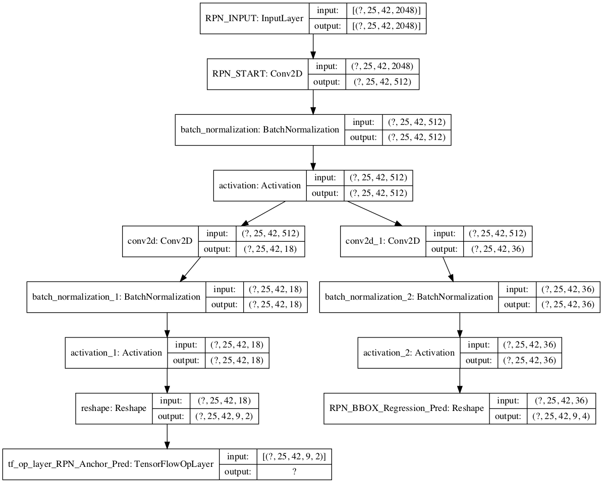
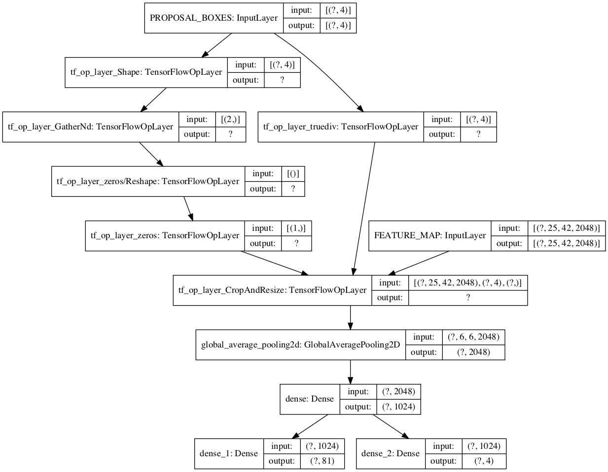

# Mask scoring r cnn with TensorFlow 2.0
## GOAL  
Complete Mask scoring r cnn with pure TensorFlow 2.0
## Introduction
### R-CNN: Regions with CNN features (2014) ([Paper](https://arxiv.org/pdf/1311.2524.pdf))

#### Steps:
1. Generate 2000 areas as candidates  
	
	Method: selective search. Use traditional methods to divide the image into several parts.
2. Calculate feature maps of the 2000 candidates  
	NN: AlexNet (2012)
3. Classify feature maps for 2000 candidates with SVM and modify the size of bounding box with bonding box regression

#### Advantages of R-CNN:  
1. Used CNN
2. Training the bonding box modification with bonding box regression
#### Disadvantages of R-CNN:
1. Selective search is time-consuming
2. Need to calculate all feature maps for 2000 RoI (Region of interested)
3. Training three-part separately requires massive storage

### Fast R-CNN (2015)([Paper](https://arxiv.org/abs/1504.08083))

#### Steps:
1. Generate 2000 areas as candidates with selective search ( same as R-CNN )
2. Only calculate feature maps for the original image 
3. Pick up the feature of RoI with ‘RoI Pooling Layer.’
4. Implement the Classification and Bbox prediction with an FC Layer

#### Advantages of Fast R-CNN:
1. Instead of calculating 2000 feature maps, Fast R-CNN only calculate one feature map and get the desired feature with ‘RoI Pooling Layer.’
2. Beside the selective search, all parts are trained end-to-end

#### Disadvantages of Fast R-CNN:
1. Still using ‘selective search.’

### Faster R-CNN (2016)([Paper](https://arxiv.org/abs/1506.01497))

#### Steps:
1. Only calculate feature maps for the original image
2. Input feature maps into the RPN ( Region Proposal Network ) to generate proposals
3. Input proposals and feature maps into RoI Pooling Layer and then get bbox and category with FC Layer

#### Advantages of Faster R-CNN:
1. Achieved end-to-end training
## Details of NN
### RPN ( Region Proposal Network )

RPN is just like the convolution, it slides the window on the image and generate 9 preset anchor boxes ( three area 128^2, 256^2, 512^2, three ratios 1:1, 1:2, 2:1 )
If the size of feature map is 40*60, then total number of the anchors is 40*60*9
For each anchor (pixel or point), there are two header NN:
1. conv(1,1,18) Classify it foreground or background, since we have 9 anchor boxes, for each anchor box we need to calculate two scores, one for foreground and one for background. Therefore, the output is , the value indicates the score and only select one ( with softmax activation function )  
    * When training:
        * foreground: IoU of anchor box and ground truth > 0.7
        * background: IoU of anchor box and ground truth < 0.3
        * discard the anchors with 0.3 < IoU < 0.7
        * Randomly choose 128 foregrounds and 126 backgrounds
2. conv(1,1,36) Modify the bonding box, since for each point we have 9 preset anchors and we need (tx, ty, th, tw) to modify the bounding box, we have the output as 9*4=36  
    * current position: (x, y), size: (H, W)
    * after modified: position: (x+tx, y+ty), size: (H * th, W * tw)
    * Loss function: SmoothL1loss
    * Here only training the NN for 128 positive anchors, therefore, the final loss function is expressed as follows:
### RoI Pooling Layer
Purpose: for each RoI, pick the corresponding features from feature maps to input them to the following FC Layer.  
procedures:  
1. Get the features of RoI
2. Reshape that features to fit the input shape of FC Layer

For example: as shown in this figure,
For each RoI, RoI Pooling Layer reshapes
The size of feature maps to 7*7

Similar to the RPN, RoI Pooling Layer also only trains the positive RoI.

## Update 2020/02/15
* made RPN(Region Proposal Network) head  

* made RoI(Region of Interest) head

## TODO
* optimize the program
* mask head
* score head
* convert to tensorflow lite
## Resources for learning Mask scoring r cnn
* [Faster_RCNN Pytorch implementation](https://github.com/Jacqueline121/Faster_RCNN_pytorch)
* [Faster_RCNN Pytorch implementation2](https://github.com/chenyuntc/simple-faster-rcnn-pytorch)
* [Mask R CNN blog](https://blog.csdn.net/jiongnima/article/details/79094159)